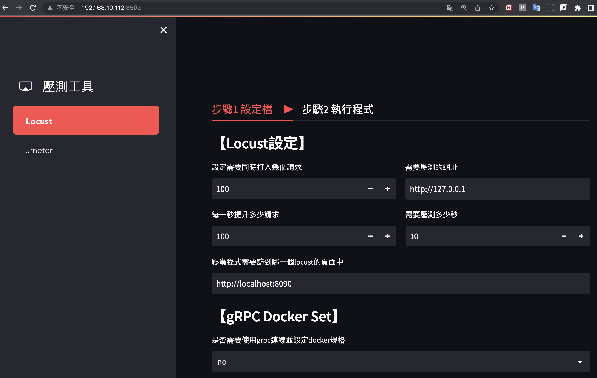

## LocustSyncChronos
---
[中文版](./README.md) [English](./README-en.md)


## Project Description
The purpose of this project is to improve the limitations of Locust in distributed load testing and provide a user-friendly management interface. It also includes a timer feature to control and monitor the execution time during stress testing. Additionally, the interface supports synchronizing scripts across different workers to maintain script consistency in a distributed deployment.

##  Key Features
* Distributed Connection Management: Users can specify the target URL, number of connections, and connection rate through the management interface. The system will automatically distribute the connections to different workers, enabling distributed load testing.

* Timer: The management interface includes a timer feature where users can set the execution time to control the duration of the stress test. The timer displays the remaining time and provides an option to end the test.

* Script Synchronization: Users can synchronize test scripts to different workers through the management interface. This ensures that all workers run the same script in a distributed deployment, ensuring consistency in test results.

## Project Highlights

- [x] Single-node stress testing
- [x] Distributed stress testing
- [x] Automated stress testing
- [x] Timer for stopping the stress test
- [x] Automated CSV generation
- [x] Management interface

## Usage
1. **Download the project**
    ```sh
    git clone https://github.com/bruce601080102/LocustSyncChronos.git
    ```

2. **Install dependencies**
    ```sh
    pip install -r requirements.txt
    ```
    [Detailed deployment instructions](https://github.com/bruce601080102/LocustSyncChronos/wiki/Github%E5%B0%88%E6%A1%88%E9%83%A8%E7%BD%B2)


## 筆記
[Locust usage notes記](https://www.notion.so/locust-16c0926f26f54565a393f02204564653)


